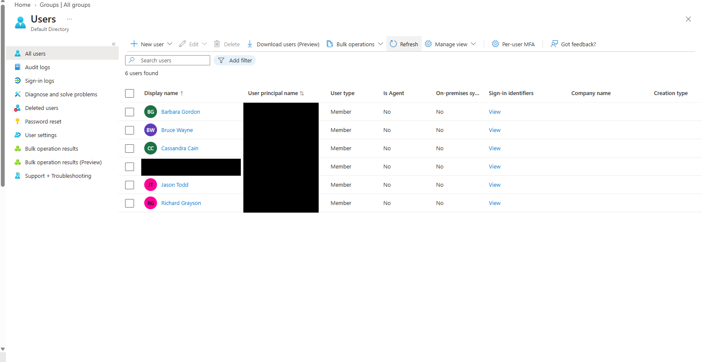
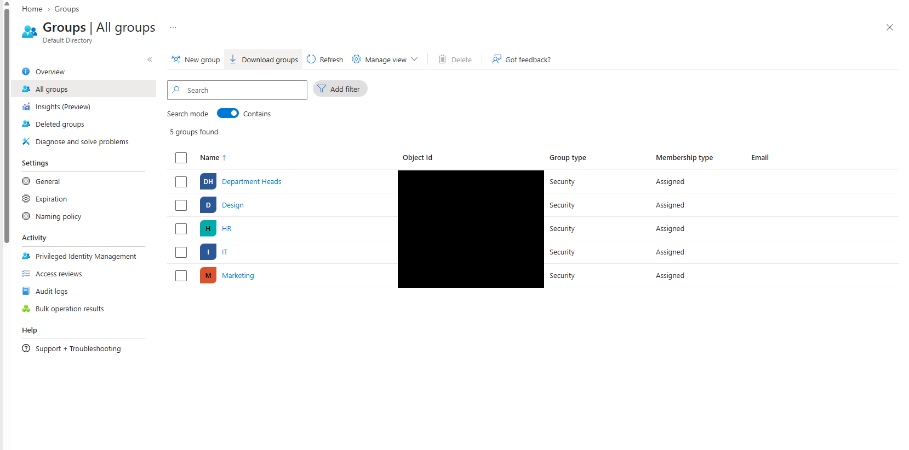
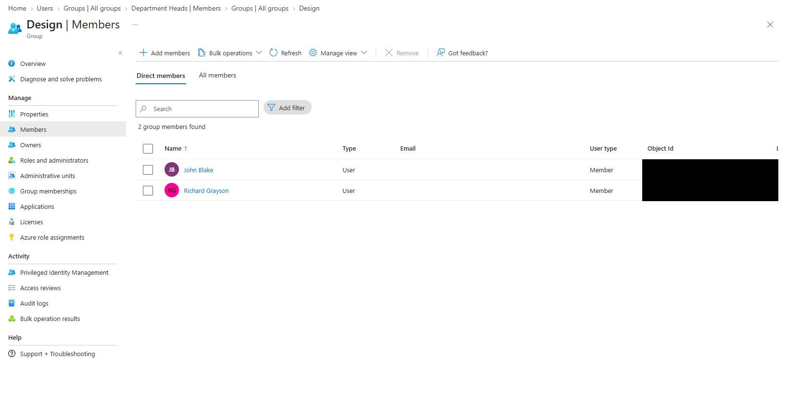
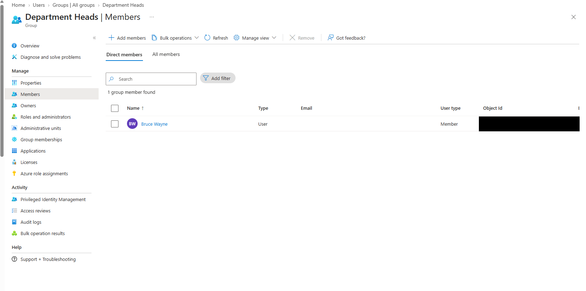
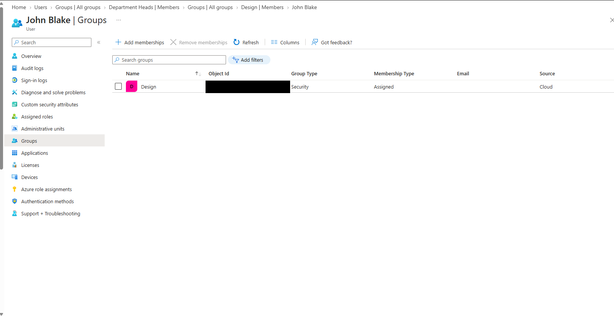
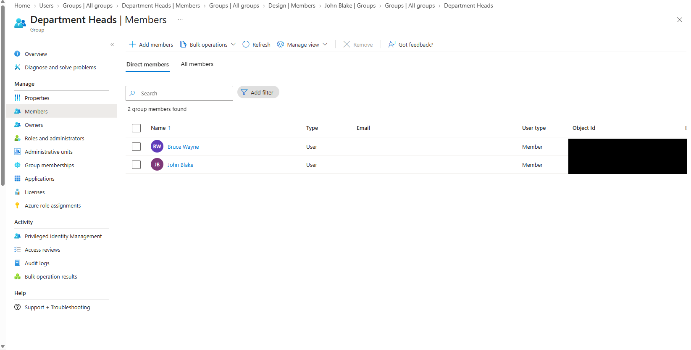
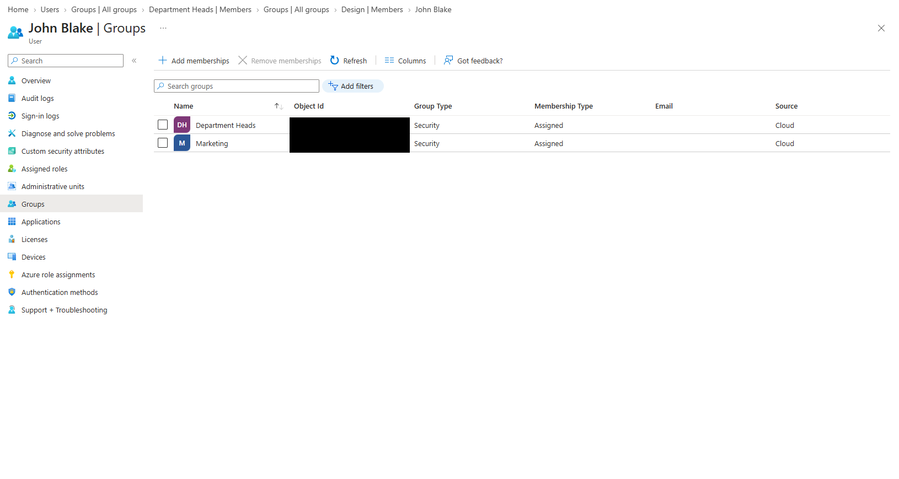

# Lab 01 — Microsoft Entra ID user lifecycle

**Status:** Sanitized before-and-after membership evidence published. Department profile, account-enabled state, other-user checks, and PowerShell validation remain pending.

## Business scenario

Gotham Legal Services needs department-based identity management. Create fictional users and security groups, assign initial memberships, then transfer John Blake from Design to Marketing and add him to Department Heads. Remove his outdated Design membership and verify the final state.

## Prerequisites and scope

- A dedicated Microsoft Entra ID lab tenant and an account with permission to create users and manage ordinary security groups.
- Cloud-only users; Security groups with **Assigned** membership. Department Heads must not be a role-assignable group.
- Replace `example.invalid` in the planning CSV with your verified lab domain before creating users. The CSV is a planning format, not the Entra portal's bulk-import schema.
- This scenario checks department metadata and three direct group memberships. No application permissions are configured by this starter. Group membership alone does not prove effective application access.

## Initial setup

1. Review [user seed data](../../csv/users-template.csv). This is an illustrative planning template, not an export of the captured tenant. In the supplied baseline evidence, Design contains John Blake and Richard Grayson; Department Heads contains Bruce Wayne. John begins with Design membership.
2. In the Microsoft Entra admin center, open **Entra ID > Users**, create each test user, and set the listed department. Use the tenant's password workflow; never put passwords in this repository.
3. Open **Entra ID > Groups** and create **Design**, **Marketing**, and **Department Heads** as Security groups with Assigned membership. Leave Microsoft Entra role assignment disabled.
4. Use [the membership plan](../../csv/membership-plan.csv) as a planning example; it is not the observed tenant roster. Record the actual baseline memberships and object IDs privately for verification.
5. Capture John's initial department and group memberships. He should belong to Design and not to Marketing or Department Heads.

## Transfer John Blake

1. Record the requested transfer and initial state.
2. Edit John's user profile and change **Department** from **Design** to **Marketing**. Changing this property does not automatically change Assigned group memberships.
3. Add John to **Marketing**.
4. Add John to **Department Heads**. This represents business membership; it does not grant an Entra administrative role.
5. Remove John from **Design**. Review any separately configured Design access in your tenant and document it before changing it; do not remove unrelated memberships.
6. Refresh the user and group views and verify the final state below.

## Acceptance criteria

| Check | Expected | Actual |
| --- | --- | --- |
| John's Department | Marketing | Pending |
| Direct member of Design | No | Not listed in John's final Groups view (image 07) |
| Direct member of Marketing | Yes | Listed in John's final Groups view (image 07) |
| Direct member of Department Heads | Yes | Confirmed in Department Heads Direct members view (image 06) |
| User remains enabled | Yes | Pending |
| Other test users' memberships | Unchanged | Pending |

Run [Test-UserLifecycle.ps1](../../scripts/Test-UserLifecycle.ps1) with the exact user and group object IDs. It checks John only; manually compare the other users against your baseline. Record command output privately and publish a redacted excerpt if useful.

## Screenshot walkthrough: before → change → after

These are sanitized copies of supplied screenshots. The sequence follows the scenario's visible states, not independently verified capture timestamps. Black boxes permanently cover user principal names/email addresses, user and group object IDs (including truncated values), and a personal administrator display name/avatar. Fictional company identities and group names remain visible. The images were flattened and saved without source metadata; no original screenshots are committed.

### Before: environment and baseline memberships

**01 — User overview.** The directory contains fictional company users. This overview does not show John Blake and is not evidence of his creation or enabled state.

**02 — Security groups created.** Department Heads, Design, HR, IT, and Marketing are visible as Security groups with Assigned membership.

**03 — Design baseline.** The Direct members view contains John Blake and Richard Grayson before the transfer.

**04 — Department Heads baseline.** Bruce Wayne is the sole direct member; John is not yet listed.

**05 — John's initial memberships.** John's unfiltered Groups view lists Design only. This records membership, not his Department profile property.

### Change: Department Heads membership added

**06 — John added to Department Heads.** The Direct members view now contains Bruce Wayne and John Blake. This confirms the membership change, although no add-member dialog or audit event was supplied.

### After: final membership state

**07 — Final user Groups view.** John's unfiltered Groups view lists Department Heads and Marketing, with Design no longer listed. This supports the intended department-group transfer and removal of the outdated Design membership. It does not prove removal of independently assigned application access or transitive access.

### Remaining verification

- [ ] Capture John's Department profile property showing Marketing.
- [ ] Verify that John's account remains enabled.
- [ ] Compare other users' final memberships against the recorded baseline.
- [ ] Run the read-only verification script and publish reviewed, redacted results.
- [ ] Record the tenant execution date and actual troubleshooting or lessons learned.

Do not mark the entire lab complete until the remaining acceptance criteria are verified.

## Troubleshooting notes

Record actual issues here. Useful checks include an incorrect tenant, a duplicate display name, Assigned versus dynamic membership, stale portal views, and insufficient permissions. Use object IDs to avoid changing the wrong identity.

## Rollback

For this fictional transfer, restore John's Department to Design, restore Design membership, and remove the Marketing and Department Heads memberships added during the scenario. Check against the recorded baseline. Record any separately configured access restored and verify the result.

## Results and lessons learned

The supplied screenshots document John moving from Design-only membership to Marketing and Department Heads, with Design absent from his final Groups view. Department Heads retains Bruce Wayne and adds John. Profile metadata, account status, other users' final memberships, and script execution are not established by these screenshots.

Execution date and operator lessons learned: pending. No troubleshooting incidents have been invented.
