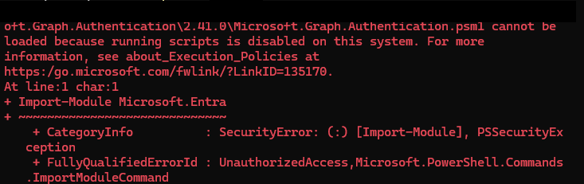

# Lab 03 — Attempted PowerShell user automation

**Status:** Automation attempt blocked during module import; user creation through the script is not demonstrated.

## Scenario

Attempt to administer or create fictional Gotham Legal Services users through a PowerShell script rather than the portal.

## Observed failure

The supplied console evidence shows `Import-Module Microsoft.Entra` failing because the Microsoft Graph Authentication module could not be loaded: **running scripts is disabled on this system**. The diagnostic reports `SecurityError`, `PSSecurityException`, and `UnauthorizedAccess` for the module import.

This evidence points to a local PowerShell execution-policy restriction. It does not establish missing Microsoft Entra administrative permissions or failed Graph consent. Authentication and tenant authorization would require separate validation after the module can load.

## Troubleshooting plan

1. Inspect the effective policies with the read-only command `Get-ExecutionPolicy -List` in the affected Windows PowerShell session.
2. Determine whether organizational Group Policy controls script execution. Review the module source and signing requirements with the system administrator.
3. Use an approved policy and module installation method, then retry the module import.
4. After a successful import, verify the intended lab tenant, authentication, consent, and administrative permissions before attempting user changes.
5. Capture a redacted execution result and verify any created users against the intended input.

These steps are proposed follow-up work; no policy change or successful retry is claimed. Microsoft explains policy scopes and precedence in [about_Execution_Policies](https://learn.microsoft.com/en-us/powershell/module/microsoft.powershell.core/about/about_execution_policies/).

## Evidence and limits

The local Windows username is permanently masked. The error text remains intact. No user-creation script, script output, or successful PowerShell account creation was supplied for this lab. The existing Lab 01 verification script is a separate artifact.

## Lesson learned

Check local prerequisites before troubleshooting cloud permissions. A module import failure can prevent the workflow from reaching authentication or user creation at all.
