# Lab 04 — Offboarding screenshots

Flattened PNG copies with permanent solid black redactions. Original files are excluded from publication. Captions describe only what each capture supports.

## Account enabled before offboarding

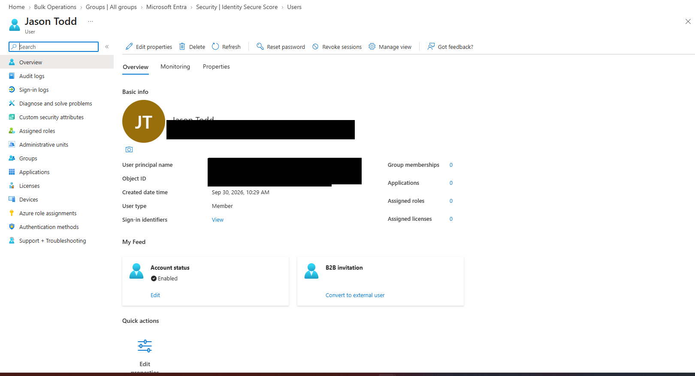

## Security group membership before removal

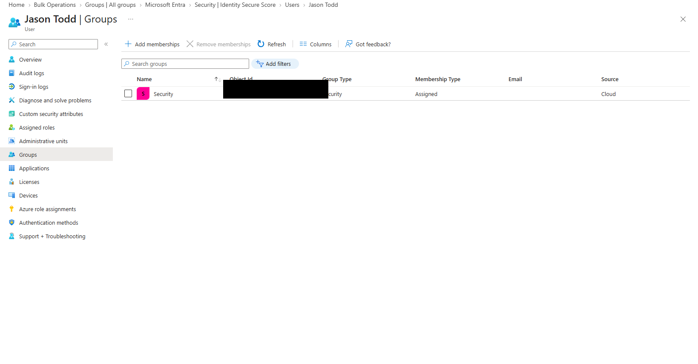

## Account enabled setting before change

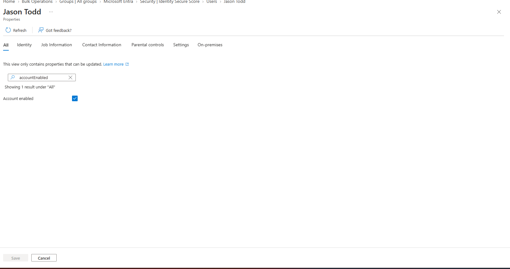

## Account disabled after change

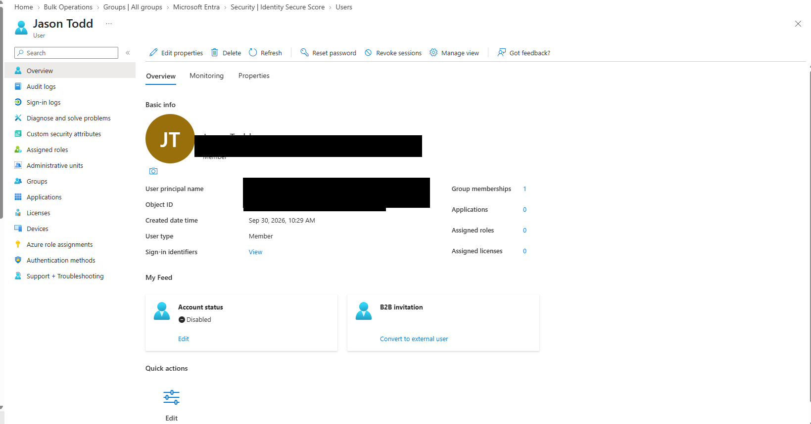

## Group removal confirmation; final result unverified

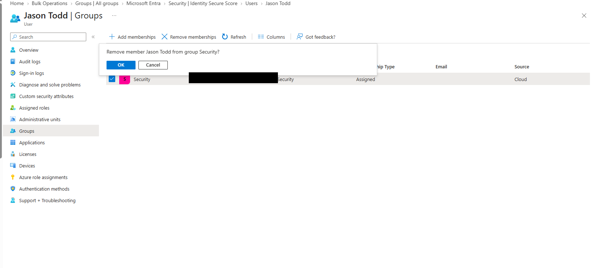

## Session revocation confirmation

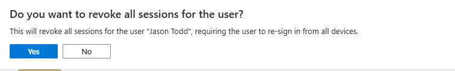

## Audit overview

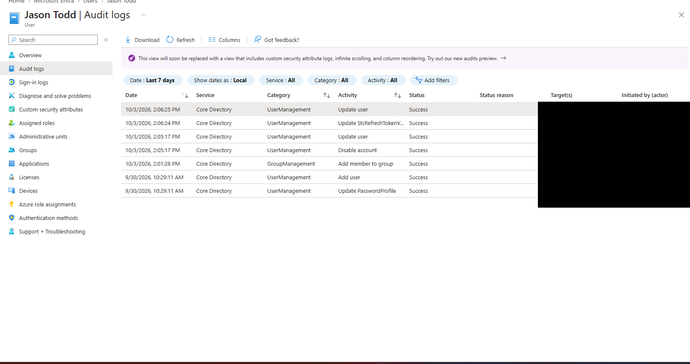

## Successful Update user event

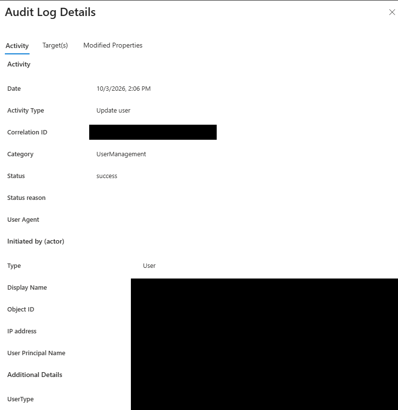

## Successful session timestamp update

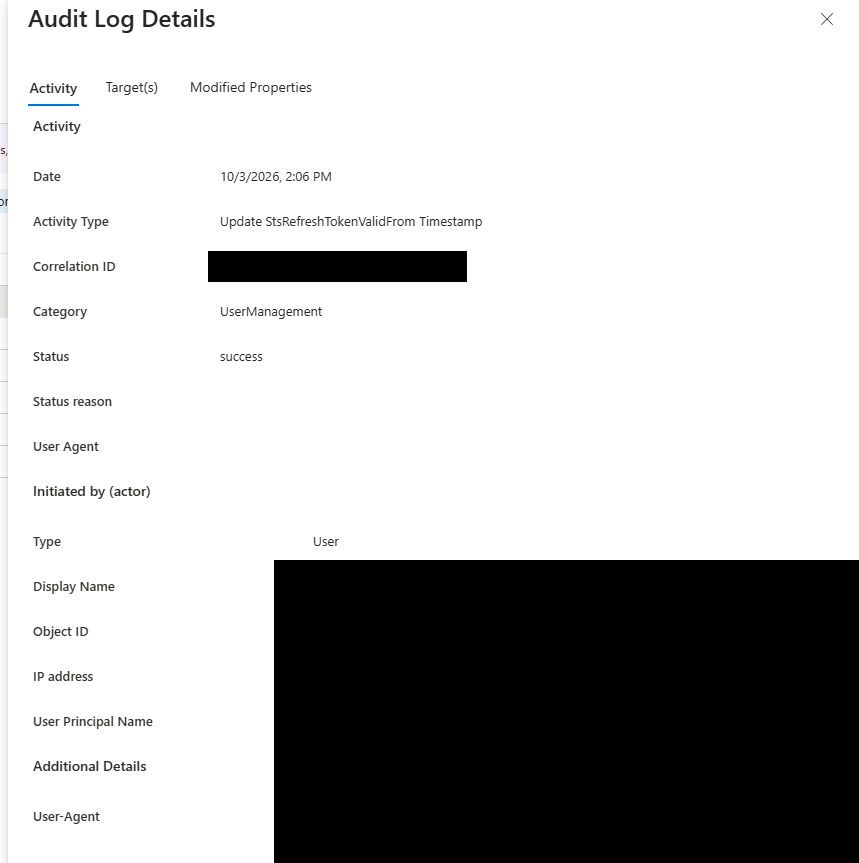

## Successful Update user event

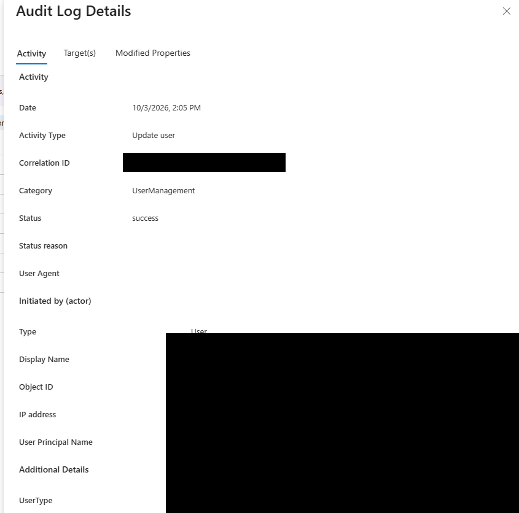

## Successful Disable account event

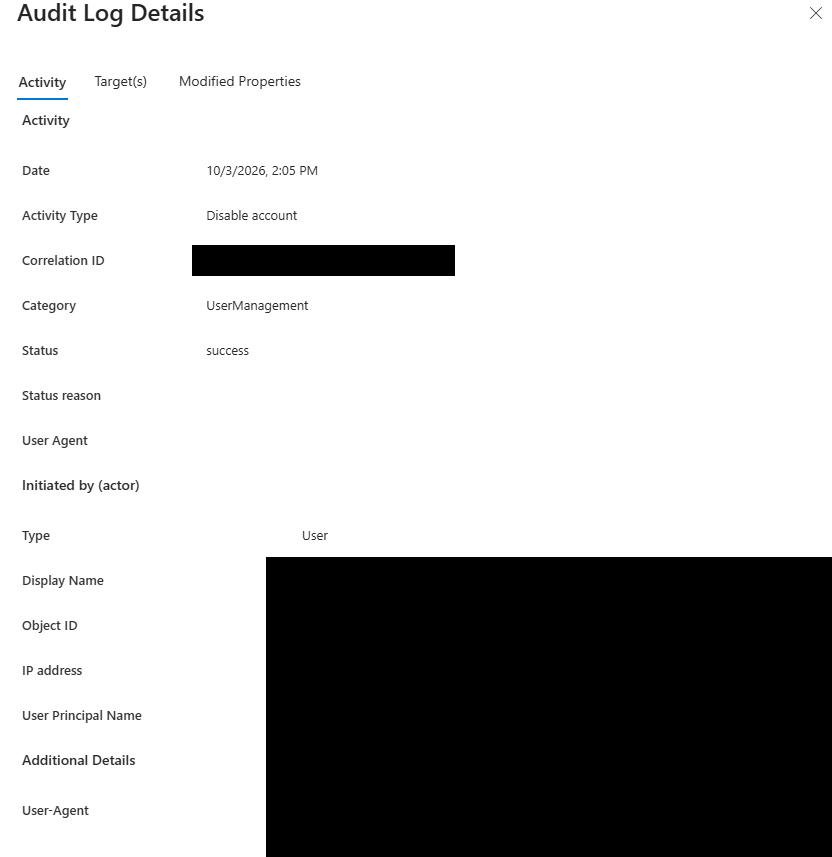
